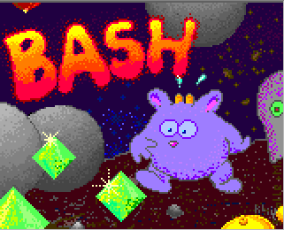

# BASH
A Boulderdash clone for MS-DOS (or DOSBox)

## Quick start

I created BASH a long time ago in 1994. In order to run it today you either need a very old computer (with MS-DOS) or an emulator.

Best option is to download [DOSBox](https://www.dosbox.com/) for your operating system.
After installing and starting DOSBox you'll see the good old MS-DOS screen.
Now copy all binary files from the binary directory of this repo to a local directory on your harddrive, for example `c:\games\bash` (assuming you're using a windows computer).

For the DOSBox to work with this directory, you have to mount it using the following command

`mount c c:\games`

This makes your local directory `c:\games` available in DOSBox as drive `c:`.

If you chose a different local directory you have to modify the command from above. After mounting you change to the mounted drive, cd to the subdirectory and run bash:

```
c:
cd bash
bash
```


If everything went fine, you should see a copyright note (hit any key to continue) and then the game's splash screen:



First thing you should do after starting the game is to press F2 to disable sound. As I wrote bash back in 1994 I used the PC speaker for sounds and this was just terrible. I worked on a soundblaster version but I never finished it. So I suggest to turn the sound off and to live with your imagination.

You can get help by pressing F1


Highlighted levels can be directly accessed (by pressing Enter with the red arrow located in front of the level name). Levels in dark green are available once you finish the level before. In the example below you could play levels 1 or 8 but in order to play level 2 you have to finish level 1.


Within the game try to collect all diamonds. The number of remaining diamonds you have to collect is displayed in the status line on the left side.


Levels usually come with a time limit. The remaining time is displayed in the status line on the right. Some levels contain clock-items that add some extra time when being collected.

You can save your current progress in the games by pressing 'S' from the main menu. There are multiple slots for the saved games and you can give your save game a name.


## Level design

You may design your own levels. Details are explained in the original readme file located in the src directory. Please note that this is a text file in DOS format (OEM 852). To read it you better convert it. For example, in Notepad++ you can use menu command Encoding/Character sets/Central European/OEM 852.

An example for custom levels is located in the src/NEU.LEV file.
In order to play these levels you simply start bash with the given level file as a parameter (which has to be copied on your mounted directory as well), for example

```
bash neu.lev
```

All the original levels are included in file `src/1.LEV`.

## Source code

The complete source code is located in the src directory. It can be compiled with Turbo Pascal 7.0. In order to do so I recommend a version of DOSBox including Turbo Pascal. You can find one here: [https://sourceforge.net/projects/turbopascal-wdb/](https://sourceforge.net/projects/turbopascal-wdb/)

All resources (images, levels etc.) are located in src/res.
Please note that images are in the .PCX format of Paintbrush, the former paint program in MS-DOS and early Windows.
You can open these files using GIMP. For example, the bitmap file for the main player character is 200.PCX and looks like this:


All resources are compiled into a single binary file using `packres.pas`. This results in the file `BASH.RES` that I included in the bin folder of this repo in order to run the game.

## Special thanks
Thanks go out to Jan Smolczyk for all the game's graphics and level design. The game wouldn't have been possible without him.
Also to Kris Arndt for helping figuring out the programming of the VGA graphic adapter and to the beta testing team (in alphabetical order): Maria Bartual, Dagmar Behmer, Guido Eickvonder, Ulrich Petrikowksy and Ina Pünder.
